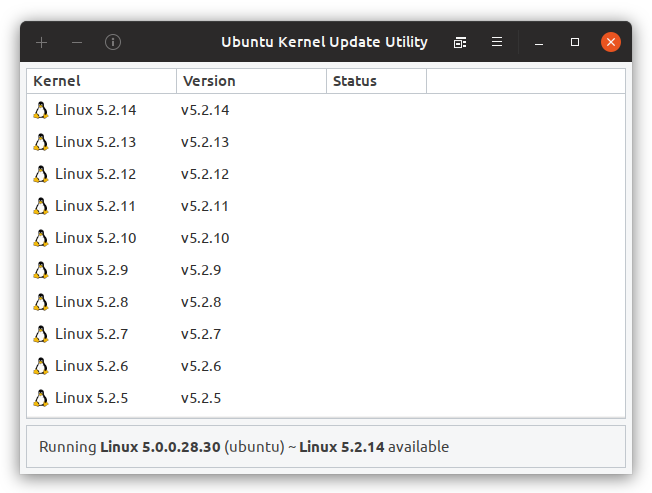

    

<h1 align="center">
    <b>Ubuntu Kernel Update Utility</b>
</h1>

    A graphical utility for managing kernels on Ubuntu-based platforms.

 

    

 

<h2>Features</h2>
<ul>
    <li>Download and install kernel packages automatically.</li>
    <li>Notifies when new kernel releases are available.</li>
    <li>Purge all-but the (current) running kernel.</li>
    <li>View release changelogs.</li>
</ul>

<h2>Changes Since 18.9.1</h2>
<h3>18.10 (Upcoming Release)</h3>
<ul>
    <li>Refreshed user interface.</li>
    <li>Transitioned to the meson build system.</li>
    <li>Removed intrusive prompts and nagware.</li>
    <li>Fixed numerous build issues.</li>
</ul>

<h2>Source Code</h2>
<h3>Build Instructions</h3>

    sudo apt install valac meson libgtk-3-dev libgee-0.8-dev libjson-glib-dev libvte-2.91-dev libsoup2.4-dev
    git clone https://github.com/joshuadowding/ukuu.git && cd ukuu
    meson build --prefix=/usr
    cd build && ninja
    sudo ninja install

<h3>Packaging Dependencies</h3>

    sudo apt install pbuilder debhelper dh-make autotools-dev

<h3>Runtime Dependencies</h3>

    sudo apt install rsync aria2 aptitude curl

